# Central Planning POC — ERD & Backend Data Model

**Target:** AWS DynamoDB
**Naming:** Clean English domain names + dedicated `sap_mapping` table linking every logical field back to its SAP source (`mara`, `makt`, `t001w`, `yho_*`, etc.).
**Scope of this pass:** Core operational + promotions (regular + ACES) + cannibalization. KPI snapshots, audit, and integration-staging tables are deferred to pass 2.
**Date:** 2026-05-29

---

## 1. Conceptual model — what this schema represents

Five logical sub-domains, all linked through `Item` and `Store` / `Warehouse`:

1. **Master data** — items (incl. leading barcode + מקבץ), stores, formats, warehouses, vendors, display types.
2. **Assortment** — what each store-format and each WH is allowed to order, by which supply method (1 = direct from vendor, 2 = via chain WH).
3. **MRP** — daily recommendations for WH (classical MRP, 9-BOX driven) and for store (operational stock + stock-on-the-way + safety stock − forecast for coverage). Plus the Central Planner חלוקה screen output.
4. **Promotions** — regular ("universe") and ACES, with store-item allocation rows, ACES strength-scale forecasts, and WH supply waves.
5. **Cannibalization** — trees (vendor-suggested vs by-design parallel), members, and per-member influence percentages.

A logical ERD follows below, then per-entity field specs, then the DynamoDB physical layout (PK/SK/GSIs and access patterns), then SAP source mapping, then open questions.

---

## 2. Logical ERD (Mermaid)

```mermaid
erDiagram
    FORMAT ||--o{ STORE : "hosts"
    FORMAT ||--o{ ASSORTMENT_LINE : "scope=STORE_FORMAT"
    WAREHOUSE ||--o{ ASSORTMENT_LINE : "scope=WAREHOUSE"
    ITEM ||--o{ ASSORTMENT_LINE : "carried in"
    ITEM ||--o| ITEM : "leading_barcode (partner-in-stock)"
    ITEM_GROUP ||--o{ ITEM : "מקבץ"
    ITEM_GROUP ||--o| ITEM : "leader"
    VENDOR ||--o{ ASSORTMENT_LINE : "supply_vendor"
    VENDOR ||--o{ ITEM : "original_vendor"
    DISPLAY_TYPE ||--o{ STORE_PLANOGRAM : "category"
    DISPLAY_TYPE ||--o{ PROMOTION : "Z-code"

    STORE ||--o{ STORE_PLANOGRAM : "per item"
    ITEM ||--o{ STORE_PLANOGRAM : "min display qty"

    WAREHOUSE ||--o{ WH_9BOX : "per item"
    ITEM ||--o{ WH_9BOX : "9-BOX classification"

    WAREHOUSE ||--o{ WH_MRP_LINE : "daily run"
    ITEM ||--o{ WH_MRP_LINE : ""
    VENDOR ||--o{ WH_MRP_LINE : ""

    STORE ||--o{ STORE_MRP_LINE : "per order day"
    ITEM ||--o{ STORE_MRP_LINE : "lead item"

    CENTRAL_PLANNER_RUN ||--o{ CENTRAL_PLANNER_ALLOCATION : "produces"
    STORE ||--o{ CENTRAL_PLANNER_ALLOCATION : ""
    ITEM ||--o{ CENTRAL_PLANNER_ALLOCATION : ""

    PURCHASE_ORDER ||--o{ PURCHASE_ORDER_LINE : ""
    PURCHASE_ORDER }o--|| VENDOR : "supplier (DIRECT / WH_PURCHASE)"
    PURCHASE_ORDER }o--o| PROMOTION : "linked promo"
    PURCHASE_ORDER_LINE }o--|| ITEM : ""

    LOCATION_STOCK }o--|| ITEM : "on hand"
    STOCK_ON_THE_WAY }o--|| ITEM : "inbound"

    FORECAST }o--|| ITEM : "per location, per period"

    PROMOTION ||--o{ PROMOTION_ALLOCATION : "store-item rows"
    PROMOTION ||--o{ PROMOTION_ACES_STRENGTH : "ACES only"
    PROMOTION ||--o{ PROMOTION_WH_WAVE : "WH supply waves"
    PROMOTION }o--o| ITEM_GROUP : "representing group (מקבץ)"
    PROMOTION }o--o| ITEM : "representing barcode"
    PROMOTION_ALLOCATION }o--|| STORE : ""
    PROMOTION_ALLOCATION }o--|| ITEM : ""

    CANNIBALIZATION_TREE ||--o{ CANNIBALIZATION_MEMBER : ""
    CANNIBALIZATION_MEMBER }o--|| ITEM : ""
    CANNIBALIZATION_SUGGESTION ||--o{ CANNIBALIZATION_TREE : "approved → tree"

    OUT_OF_STOCK_BLOCK }o--|| STORE : ""
    OUT_OF_STOCK_BLOCK }o--|| ITEM : ""
    OUT_OF_STOCK_BLOCK }o--o| PROMOTION : ""

    TRADE_AGREEMENT }o--|| VENDOR : ""
    TRADE_AGREEMENT }o--o| ITEM : ""
    TRADE_AGREEMENT }o--o| ITEM_GROUP : ""
    TRADE_AGREEMENT }o--o| PROMOTION : ""
```

---

## 3. Entity field specs

> **Types** below are logical (string, number, decimal, date, datetime, enum, list, map). DynamoDB physical types (S, N, B, M, L, BOOL) are applied in §4.
> **PK/SK markers** describe DynamoDB layout (table layout detailed in §4).
> **Units:** every quantity that isn't already in a single unit carries `_qty_base` (base unit of measure, e.g. kg or each) or `_qty_order_unit` (vendor order unit, e.g. case of 12).

### 3.1 Master data

#### `item` — barcode-level master
| Field | Type | Notes |
|---|---|---|
| `barcode` | string (EAN-13) | **PK**. From `mara.EAN11`. |
| `material_number` | string | SAP `mara.MATNR`. |
| `description` | string | From `makt.MAKTX` (lang `B`). |
| `unit_type` | enum `WEIGHABLE` / `UNITS` | Spreadsheet "שקיל או יחידות". |
| `base_uom` | string | e.g. `EA`, `KG`. |
| `order_uom` | string | Vendor order unit (case, pallet). |
| `qty_per_order_unit` | decimal | Conversion factor. |
| `leading_barcode` | string nullable | If set and ≠ `barcode` → this item is a *partner-in-stock*; aggregate MRP/forecast/sales onto the leader. |
| `item_group_code` | string nullable | מקבץ. FK → `item_group.group_code`. |
| `original_vendor_id` | string nullable | Default vendor of record (`mara` vendor link). |
| `display_type_default` | string nullable | Default Z-code. |
| `dept_lv2_code` / `dept_lv2_name` | string | From `ymr_art_hierchy`. |
| `is_active` | boolean | |
| `created_at` / `updated_at` | datetime | |

Derived: `is_partner_in_stock = (leading_barcode IS NOT NULL AND leading_barcode != barcode)`, `is_standalone = NOT is_partner_in_stock`.

#### `item_group` — מקבץ
| Field | Type | Notes |
|---|---|---|
| `group_code` | string | **PK**. `mara.BISMT` of the parent (`mtart='YGRP'`). |
| `description` | string | `makt.MAKTX` of parent. |
| `leader_barcode` | string nullable | The barcode the group is planned/aggregated against for promos. |
| `purpose` | enum `PROMO_AGGREGATION` / `CANNIBALIZATION_HINT` / `BOTH` | Why the group exists. |
| `created_at` / `updated_at` | datetime | |

#### `format` — distribution channel (VTWEG)
| Field | Type | Notes |
|---|---|---|
| `format_code` | string | **PK**. `t001w.VTWEG` (`2 שלי`, `8 יוניברס`, …). |
| `description` | string | |
| `is_active` | boolean | |

#### `store`
| Field | Type | Notes |
|---|---|---|
| `store_id` | string | **PK**. `t001w.WERKS`. |
| `name` | string | `t001w.NAME1`. |
| `format_code` | string | FK → `format`. |
| `store_size_class` | enum `S` / `M` / `L` / `XL` | For central-planner forced-quantity distribution. |
| `sale_capability_score` | decimal nullable | Per-category sales capability (relative). May live in a per-category sub-record (see open Q #4). |
| `is_active` | boolean | |

#### `warehouse`
| Field | Type | Notes |
|---|---|---|
| `warehouse_id` | string | **PK**. |
| `name` | string | |
| `is_active` | boolean | |

#### `vendor`
| Field | Type | Notes |
|---|---|---|
| `vendor_id` | string | **PK**. `lfa1.LIFNR` (alpha-converted). |
| `name` | string | `lfa1.NAME1`. |
| `default_lead_time_days` | integer | Fallback when 9-BOX missing. |
| `is_active` | boolean | |

#### `display_type`
| Field | Type | Notes |
|---|---|---|
| `code` | string | **PK**. Z-code (`Z137`…). |
| `description_he` | string | "גונדולה משתנה". |
| `description_en` | string | "Variable gondola". |
| `is_sap_standard` | boolean | `ZASO/ZPLA/ZPRO`. |

### 3.2 Assortment

#### `assortment_line`
A single row both for store-format assortment **and** WH assortment (distinguished by `scope`). User confirmed WHs don't share SKUs — that's a uniqueness constraint, not a model difference.

| Field | Type | Notes |
|---|---|---|
| `parent_scope` | enum `STORE_FORMAT` / `WAREHOUSE` | |
| `parent_id` | string | `format_code` or `warehouse_id`. |
| `item_barcode` | string | FK → `item`. |
| `active_from` | date | |
| `active_to` | date | `31.12.9999` if open-ended. |
| `is_blocked_for_order` | boolean | "חסום להזמנה?". |
| `supply_method` | enum `DIRECT` (1) / `WH` (2) | Only meaningful for `STORE_FORMAT`. WH rows = source of truth, ignore. |
| `supply_vendor_id` | string nullable | If `supply_method=DIRECT`: the vendor. If `WH`: the warehouse_id supplying. |
| `original_vendor_id` | string | The original/manufacturer vendor regardless of supply path. |
| `notes` | string nullable | |
| `created_at` / `updated_at` | datetime | |

#### `store_planogram` — per-store min display qty
| Field | Type | Notes |
|---|---|---|
| `store_id` | string | |
| `item_barcode` | string | |
| `display_type_code` | string nullable | |
| `planogram_min_stock_qty` | decimal | "כמות מינימלית לתצוגה". |
| `effective_from` | date | |

### 3.3 9-BOX (WH only)

#### `wh_9box`
| Field | Type | Notes |
|---|---|---|
| `warehouse_id` | string | |
| `item_barcode` | string | |
| `velocity_class` | enum `H` / `M` / `L` | 3 axes side 1. |
| `forecast_accuracy_class` | enum `H` / `M` / `L` | 3 axes side 2. |
| `vendor_lead_time_days` | integer | Other dimension used by the 9-BOX. |
| `forecast_for_period_qty` | decimal | Period forecast that feeds reorder/target derivation. |
| `reorder_point_qty` | decimal | Derived. |
| `target_stock_level_qty` | decimal | Derived. |
| `effective_from` | date | |
| `derived_at` | datetime | |
| `source` | enum `AUTO_CALC` / `MANUAL_OVERRIDE` | |

> The 9-BOX classification (H/M/L × H/M/L) plus lead time and forecast are inputs; reorder point and target are outputs. Both stored so consumers don't recompute.

### 3.4 Stock

#### `location_stock` — current on-hand
| Field | Type | Notes |
|---|---|---|
| `location_scope` | enum `STORE` / `WAREHOUSE` | |
| `location_id` | string | |
| `item_barcode` | string | |
| `on_hand_qty_base` | decimal | |
| `last_counted_at` | datetime | |

#### `stock_on_the_way` — open inbound
| Field | Type | Notes |
|---|---|---|
| `location_scope` | enum `STORE` / `WAREHOUSE` | |
| `location_id` | string | |
| `item_barcode` | string | |
| `qty_base` | decimal | Aggregate of open inbound. |
| `next_expected_arrival_at` | date | |
| `po_ids` | list<string> | Source POs (for drilldown). |
| `last_recomputed_at` | datetime | |

### 3.5 MRP outputs

#### `wh_mrp_line` — classical MRP, daily, per active WH-item
| Field | Type | Notes |
|---|---|---|
| `snapshot_date` | date | |
| `run_timestamp` | datetime | |
| `warehouse_id` | string | |
| `item_barcode` | string | |
| `vendor_id` | string | |
| `recom_qty_base` | decimal | |
| `recom_qty_order_unit` | decimal | |
| `current_stock_days` | decimal | |
| `reorder_point_qty` | decimal | From `wh_9box`. |
| `target_stock_level_qty` | decimal | From `wh_9box`. |
| `sd_orders_qty` | decimal | Open customer (SD) orders. |
| `sto_orders_qty` | decimal | Open store transfer (STO) orders. |
| `forecast_coverage_qty` | decimal | Forecast for coverage period. |
| `stock_on_the_way_qty` | decimal | |
| `lead_time_days` | integer | |
| `adoption_status` | enum `PENDING` / `ADOPTED` / `MODIFIED` / `REJECTED` | Feeds % adoption KPI. |

#### `store_mrp_line` — store MRP, per order day, leading-item level
| Field | Type | Notes |
|---|---|---|
| `snapshot_date` | date | |
| `run_timestamp` | datetime | |
| `store_id` | string | |
| `leading_barcode` | string | Aggregation key. Standalone items use their own barcode. |
| `supply_method` | enum `DIRECT` / `WH` | |
| `supply_source_id` | string | `vendor_id` if DIRECT, `warehouse_id` if WH. |
| `recom_qty_base` | decimal | |
| `recom_qty_order_unit` | decimal | |
| `operational_stock_qty` | decimal | מלאי תפעולי. |
| `min_safety_stock_qty` | decimal | מלאי ביטחון. |
| `lead_time_days` | integer | |
| `stock_on_the_way_qty` | decimal | |
| `forecast_coverage_qty` | decimal | Forecast until next supplier delivery date. |
| `next_delivery_date` | date | |
| `adoption_status` | enum (as above) | Feeds % store recommendation touch-rate KPI. |

### 3.6 Central Planner חלוקה

#### `central_planner_run` — header
| Field | Type | Notes |
|---|---|---|
| `run_id` | string (uuid) | |
| `start_date` | date | |
| `coverage_days` | integer | "ימי כיסוי". |
| `optional_force_qty` | decimal nullable | "כמות דחיפה בכוח". |
| `store_filter` | list<string> | Selected store IDs (or "all in format X"). |
| `item_filter` | list<string> | Selected leading barcodes. |
| `linked_promo_id` | string nullable | If this run was triggered by a promotion campaign. |
| `created_by` | string | |
| `created_at` | datetime | |
| `status` | enum `DRAFT` / `CALCULATED` / `APPLIED` / `CANCELLED` | |

#### `central_planner_allocation` — line per store-item
| Field | Type | Notes |
|---|---|---|
| `run_id` | string | |
| `store_id` | string | |
| `leading_barcode` | string | |
| `supply_method` | enum `DIRECT` / `WH` | |
| `supply_source_id` | string | |
| `recom_qty_base` | decimal | |
| `recom_qty_order_unit` | decimal | |
| `operational_stock_qty` | decimal | |
| `planogram_min_stock_qty` | decimal | From `store_planogram`. |
| `stock_on_the_way_qty` | decimal | |
| `forecast_coverage_qty` | decimal | |
| `store_size_class` | enum | Snapshot from `store`. |
| `sale_capability_score` | decimal nullable | For category-aware push. |
| `forced_qty` | decimal nullable | If `optional_force_qty` distributed here. |
| `final_qty` | decimal | What will be ordered. |

### 3.7 Purchase orders

#### `purchase_order` — header
| Field | Type | Notes |
|---|---|---|
| `po_id` | string (uuid) | |
| `po_number` | string | External PO number. |
| `po_type` | enum `STO` (store↔WH) / `DIRECT` (store↔vendor) / `WH_PURCHASE` (WH↔vendor) | |
| `source_location_scope` | enum `STORE` / `WAREHOUSE` | |
| `source_location_id` | string | |
| `destination_location_scope` | enum `STORE` / `WAREHOUSE` | |
| `destination_location_id` | string | |
| `vendor_id` | string nullable | Null for STO. |
| `origin` | enum `MRP_AUTO` / `CENTRAL_PLANNER` / `MANUAL` / `PROMO` | Lineage. |
| `linked_promo_id` | string nullable | |
| `linked_run_id` | string nullable | Central planner run. |
| `status` | enum `DRAFT` / `SUBMITTED` / `CONFIRMED` / `IN_TRANSIT` / `DELIVERED` / `CANCELLED` | |
| `created_at` | datetime | |
| `expected_delivery_date` | date | |
| `delivered_at` | datetime nullable | |

#### `purchase_order_line`
| Field | Type | Notes |
|---|---|---|
| `po_id` | string | |
| `line_no` | integer | |
| `item_barcode` | string | |
| `qty_base` | decimal | |
| `qty_order_unit` | decimal | |
| `source_mrp_line_id` | string nullable | Traceability back to recommendation. |
| `unit_cost` | decimal nullable | |

### 3.8 Forecast

#### `forecast`
| Field | Type | Notes |
|---|---|---|
| `location_scope` | enum `STORE` / `WAREHOUSE` | |
| `location_id` | string | |
| `item_barcode` | string | Always the leading_barcode if partner-in-stock. |
| `period_start` | date | |
| `period_end` | date | |
| `forecast_qty_base` | decimal | Provider value, possibly overridden. |
| `forecast_source` | enum `PROVIDER` / `USER_OVERRIDE` / `PROMO_ANCHOR_TEC` / `CANNIBALIZATION_ADJUSTED` | |
| `provider_value_qty_base` | decimal nullable | Original provider value (kept when overridden). |
| `confidence_class` | enum `H` / `M` / `L` nullable | Feeds 9-BOX accuracy axis. |
| `anchor_tec_qty` | decimal nullable | אגרגציית חיזוי מעוגן-טק. |
| `provider_run_id` | string nullable | |
| `last_updated_at` | datetime | |
| `last_updated_by` | string | |

### 3.9 Promotions

#### `promotion` — header
| Field | Type | Notes |
|---|---|---|
| `promo_id` | string (uuid) | |
| `activity_type` | enum `REGULAR_UNIVERSE` / `ACES` | |
| `format_code` | string | "פורמט". |
| `display_type_code` | string nullable | Z-code, "אמצעי תצוגה". `null` for ACES (set later). |
| `promo_type_code` | string nullable | `Y001/Y003/Y004/…`. ACES often blank till adopted. |
| `is_newspaper` | boolean | "עיתון". |
| `loyalty_segment_code` | string nullable | `000/001/002/003`. |
| `coupon_required` | boolean | |
| `representing_barcode` | string nullable | `mara.PMATA`. |
| `item_group_code` | string nullable | מקבץ. |
| `description` | string | |
| `sap_action_number` | string nullable | |
| `campaign_code` | string nullable | |
| `reward_code` | string nullable | |
| `catalog_price` | decimal nullable | |
| `promo_price` | decimal nullable | For ACES: UNKNOWN until last-minute. |
| `gift_pma_qty` | integer nullable | |
| `start_date` | date | |
| `end_date` | date | |
| `trade_agreement_qty` | decimal nullable | |
| `store_count` | integer | "כמות סניפים". |
| `forecast_anchor_tec_qty` | decimal nullable | For REGULAR_UNIVERSE — single value. For ACES use `promotion_aces_strength`. |
| `status` | enum `WAITING_QC` (0) / `WAITING_DISTRIBUTION` (1) / `DISTRIBUTED` (3) / `QUEUED_TONIGHT` | |
| `wave_strategy` | enum `SINGLE_SHOT` / `WAVES` | Whether WH supply is wave-staged. |
| `created_at` / `updated_at` | datetime | |

#### `promotion_aces_strength`
| Field | Type | Notes |
|---|---|---|
| `promo_id` | string | |
| `strength_class` | enum `VERY_DEEP` (עמוק מאוד) / `DEEP` (עמוק) / `STRONG` (חזק) / `MEDIUM` (בינוני) | |
| `anchor_tec_forecast_qty` | decimal | |
| `selected_by_user` | boolean | Which scale the planner ultimately adopted. |

#### `promotion_allocation` — store-item allocation
| Field | Type | Notes |
|---|---|---|
| `promo_id` | string | |
| `store_id` | string | |
| `item_barcode` | string | |
| `supply_method` | enum `DIRECT` / `WH` | |
| `supply_source_id` | string | |
| `original_vendor_id` | string | |
| `display_type_code` | string nullable | |
| `allocated_qty_base` | decimal | "כמות שחולקה". |
| `ordered_qty_base` | decimal nullable | "כמות שהוזמנה" (post-fact). |
| `sold_qty_base` | decimal nullable | "כמות שנמכרה" (post-fact). |
| `forecast_anchor_tec_qty` | decimal nullable | Per-store-item forecast. For ACES: filled by selected strength class. |

#### `promotion_wh_wave` — WH supply waves
| Field | Type | Notes |
|---|---|---|
| `promo_id` | string | |
| `warehouse_id` | string | |
| `wave_no` | integer | 1, 2, 3, … |
| `target_qty_base` | decimal | |
| `planned_arrival_date` | date | |
| `actual_arrival_date` | date nullable | |
| `status` | enum `PLANNED` / `ORDERED` / `RECEIVED` / `CANCELLED` | |
| `linked_po_id` | string nullable | |

### 3.10 Cannibalization

#### `cannibalization_suggestion` — raw input from forecasting vendor
| Field | Type | Notes |
|---|---|---|
| `suggestion_id` | string (uuid) | |
| `provider_run_id` | string | |
| `suggested_at` | datetime | |
| `status` | enum `PENDING` / `APPROVED` / `REJECTED` / `MERGED_INTO_TREE` | |
| `member_barcodes` | list<string> | Items the provider believes cannibalize each other. |
| `confidence` | decimal nullable | |
| `tree_id` | string nullable | Set on approval. |

#### `cannibalization_tree`
| Field | Type | Notes |
|---|---|---|
| `tree_id` | string (uuid) | |
| `tree_type` | enum `VENDOR_SUGGESTED_MISTAKE` (overlapping assortment, narrowed later) / `USER_PARALLEL_BY_DESIGN` (multi-vendor parallel for capacity, e.g. milk) / `USER_DEFINED_OTHER` | |
| `status` | enum `DRAFT` / `APPROVED` / `REJECTED` / `RETIRED` | |
| `created_by` | string | |
| `created_at` | datetime | |
| `approved_by` | string nullable | |
| `approved_at` | datetime nullable | |
| `source_suggestion_id` | string nullable | If born from a forecaster suggestion. |
| `notes` | string | |

#### `cannibalization_member`
| Field | Type | Notes |
|---|---|---|
| `tree_id` | string | |
| `item_barcode` | string | Use leading barcode for partner-in-stock. |
| `influence_percent` | decimal | The planner-set share, e.g. 50 / 10 / 40. Must sum to 100 across tree members (validation rule). |
| `baseline_forecast_qty` | decimal | Original (pre-tree) forecast at last calc. |
| `adjusted_forecast_qty` | decimal | Forecast after applying influence_percent vs the tree's aggregate. |
| `last_recomputed_at` | datetime | |

### 3.11 Misc

#### `out_of_stock_block`
| Field | Type | Notes |
|---|---|---|
| `block_id` | string (uuid) | |
| `store_id` | string | |
| `item_barcode` | string | |
| `blocked_from` | date | |
| `blocked_to` | date | |
| `reason` | enum `OOS` / `CAMPAIGN_PREP` / `CENTRAL_PLANNER_MANAGED` / `OTHER` | |
| `linked_promo_id` | string nullable | Promo this block exists to support. |
| `blocked_by` | string | User. |
| `is_active` | boolean | |

#### `trade_agreement`
| Field | Type | Notes |
|---|---|---|
| `agreement_id` | string (uuid) | |
| `vendor_id` | string | |
| `scope_type` | enum `ITEM` / `ITEM_GROUP` | |
| `scope_id` | string | barcode or group_code. |
| `agreement_qty_base` | decimal | |
| `period_start` | date | |
| `period_end` | date | |
| `linked_promo_id` | string nullable | |
| `notes` | string | |

#### `sap_mapping` — runtime lookup for the integration layer
| Field | Type | Notes |
|---|---|---|
| `logical_entity` | string | e.g. `item`, `assortment_line`. |
| `logical_field` | string | e.g. `barcode`. |
| `sap_table` | string | e.g. `mara`. |
| `sap_field` | string | e.g. `EAN11`. |
| `join_or_filter_note` | string | Free text, e.g. "mtart='YGRP', spras='B'". |

---

## 4. DynamoDB physical model

> Convention: every table has `PK` (partition key, string) and most have `SK` (sort key, string). GSIs follow `GSIxPK` / `GSIxSK` naming. Prefixes (`ITEM#`, `STORE#`, `PROMO#`, etc.) keep keys human-readable and let several entity types coexist where useful.

### 4.1 Table list

| # | Table name | PK | SK | GSIs | Notes |
|---|---|---|---|---|---|
| 1 | `cp_items` | `ITEM#{barcode}` | `METADATA` | GSI1 leader, GSI2 group, GSI3 vendor | One item per barcode. |
| 2 | `cp_item_groups` | `GROUP#{group_code}` | `METADATA` | — | מקבץ. |
| 3 | `cp_formats` | `FORMAT#{format_code}` | `METADATA` | — | VTWEG. |
| 4 | `cp_stores` | `STORE#{store_id}` | `METADATA` | GSI1 format | |
| 5 | `cp_warehouses` | `WAREHOUSE#{warehouse_id}` | `METADATA` | — | |
| 6 | `cp_vendors` | `VENDOR#{vendor_id}` | `METADATA` | — | |
| 7 | `cp_display_types` | `DISPLAY_TYPE#{code}` | `METADATA` | — | Z-code lookup. |
| 8 | `cp_assortment` | `{parent_scope}#{parent_id}` | `ITEM#{barcode}` | GSI1 item→parents, GSI2 vendor | Holds both STORE_FORMAT and WAREHOUSE rows. |
| 9 | `cp_store_planogram` | `STORE#{store_id}` | `ITEM#{barcode}` | — | |
| 10 | `cp_wh_9box` | `WAREHOUSE#{warehouse_id}` | `ITEM#{barcode}` | GSI1 by velocity/accuracy bucket | Current snapshot. Add `cp_wh_9box_history` if audit needed. |
| 11 | `cp_location_stock` | `{location_scope}#{location_id}` | `ITEM#{barcode}` | GSI1 by item | |
| 12 | `cp_stock_on_the_way` | `{location_scope}#{location_id}` | `ITEM#{barcode}` | GSI1 by item | |
| 13 | `cp_wh_mrp` | `WAREHOUSE#{warehouse_id}#DATE#{snapshot_date}` | `ITEM#{barcode}` | GSI1 by item × date, GSI2 by vendor × date | Daily snapshot. TTL recommended (e.g. 90d). |
| 14 | `cp_store_mrp` | `STORE#{store_id}#DATE#{snapshot_date}` | `LEAD#{leading_barcode}` | GSI1 by leading_barcode × date, GSI2 by supply_source | TTL recommended. |
| 15 | `cp_central_planner` | `RUN#{run_id}` | `METADATA` / `ALLOCATION#{store_id}#{leading_barcode}` | GSI1 by status × date, GSI2 by linked_promo | Single-table for run + allocations. |
| 16 | `cp_purchase_orders` | `PO#{po_id}` | `HEADER` / `LINE#{line_no:04d}` | GSI1 source location × date, GSI2 vendor × date, GSI3 item × date, GSI4 linked_promo | Single-table for header + lines. |
| 17 | `cp_forecast` | `{location_scope}#{location_id}#ITEM#{barcode}` | `PERIOD#{period_start}#{period_end}` | GSI1 by item across locations × period | |
| 18 | `cp_promotions` | `PROMO#{promo_id}` | `METADATA` / `ACES_STRENGTH#{class}` / `ALLOC#{store_id}#{barcode}` / `WH_WAVE#{wh_id}#{wave_no:02d}` | GSI1 status × start_date, GSI2 format × start_date, GSI3 store-item, GSI4 representing_barcode | Single-table for full promotion aggregate. |
| 19 | `cp_cannibalization_suggestions` | `SUGGESTION#{suggestion_id}` | `METADATA` | GSI1 status × suggested_at | |
| 20 | `cp_cannibalization_trees` | `TREE#{tree_id}` | `METADATA` / `MEMBER#{item_barcode}` | GSI1 status × created_at, GSI2 item→trees | Single-table for tree + members. |
| 21 | `cp_oos_blocks` | `STORE#{store_id}#ITEM#{barcode}` | `FROM#{blocked_from}` | GSI1 by item × date, GSI2 by promo | |
| 22 | `cp_trade_agreements` | `VENDOR#{vendor_id}#SCOPE#{scope_type}#{scope_id}` | `PERIOD#{period_start}#{period_end}` | GSI1 by promo | |
| 23 | `cp_sap_mapping` | `ENTITY#{logical_entity}` | `FIELD#{logical_field}` | — | Reference lookup. |

### 4.2 Access patterns matrix

| # | Access pattern | Table | Operation | Key |
|---|---|---|---|---|
| AP1 | Get item by barcode | `cp_items` | GetItem | `PK=ITEM#{barcode}, SK=METADATA` |
| AP2 | List all partner-in-stock siblings of a leader | `cp_items` | Query GSI1 | `GSI1PK=LEADER#{leading_barcode}` |
| AP3 | List items in a מקבץ | `cp_items` | Query GSI2 | `GSI2PK=GROUP#{group_code}` |
| AP4 | List stores in a format | `cp_stores` | Query GSI1 | `GSI1PK=FORMAT#{format_code}` |
| AP5 | List assortment of a store-format (or WH) | `cp_assortment` | Query | `PK={scope}#{parent_id}` |
| AP6 | Which formats/WHs carry an item | `cp_assortment` | Query GSI1 | `GSI1PK=ITEM#{barcode}` |
| AP7 | Get the 9-BOX for a WH-item | `cp_wh_9box` | GetItem | `PK=WAREHOUSE#{wh_id}, SK=ITEM#{barcode}` |
| AP8 | Daily WH MRP for a WH | `cp_wh_mrp` | Query | `PK=WAREHOUSE#{wh_id}#DATE#{date}` |
| AP9 | All WH recommendations for an item on a date | `cp_wh_mrp` | Query GSI1 | `GSI1PK=ITEM#{barcode}#DATE#{date}` |
| AP10 | Daily store MRP for a store | `cp_store_mrp` | Query | `PK=STORE#{store_id}#DATE#{date}` |
| AP11 | Central planner run + all allocations | `cp_central_planner` | Query | `PK=RUN#{run_id}` |
| AP12 | List central planner runs by status (e.g. recent DRAFT) | `cp_central_planner` | Query GSI1 | `GSI1PK=STATUS#{status}` |
| AP13 | Open POs for a vendor | `cp_purchase_orders` | Query GSI2 | `GSI2PK=VENDOR#{vendor_id}` |
| AP14 | All PO lines for an item over a period | `cp_purchase_orders` | Query GSI3 | `GSI3PK=ITEM#{barcode}`, range on SK |
| AP15 | Forecast for a store-item over period | `cp_forecast` | Query | `PK=STORE#{store_id}#ITEM#{barcode}` |
| AP16 | Get promotion + every related row in one query | `cp_promotions` | Query | `PK=PROMO#{promo_id}` |
| AP17 | Active promotions in a format | `cp_promotions` | Query GSI2 | `GSI2PK=ACTIVE_PROMO#{format_code}`, range on start_date |
| AP18 | Promotions affecting a store-item | `cp_promotions` | Query GSI3 | `GSI3PK=STORE#{store_id}#ITEM#{barcode}` |
| AP19 | List ACES promos awaiting price | `cp_promotions` | Query GSI1 | `GSI1PK=STATUS#WAITING_QC` (filter `activity_type=ACES`) |
| AP20 | Cannibalization trees containing an item | `cp_cannibalization_trees` | Query GSI2 | `GSI2PK=ITEM#{barcode}` |
| AP21 | Pending forecaster suggestions | `cp_cannibalization_suggestions` | Query GSI1 | `GSI1PK=STATUS#PENDING` |
| AP22 | OOS blocks active today for an item | `cp_oos_blocks` | Query GSI1 | `GSI1PK=ITEM#{barcode}`, filter date range |
| AP23 | Trade agreements for a promo | `cp_trade_agreements` | Query GSI1 | `GSI1PK=PROMO#{promo_id}` |
| AP24 | Look up SAP source of a logical field | `cp_sap_mapping` | GetItem | `PK=ENTITY#{e}, SK=FIELD#{f}` |

### 4.3 Single-table design notes

`cp_central_planner`, `cp_purchase_orders`, `cp_promotions`, `cp_cannibalization_trees` use single-table patterns because the aggregate is always loaded together. The remaining tables keep one entity per table because their primary access pattern is independent — overloading them would add cost (longer GSI keys, more filtering) for no joinside benefit.

### 4.4 Capacity & TTL recommendations

- `cp_wh_mrp`, `cp_store_mrp`, `cp_forecast`: TTL on `snapshot_date + 90d` (or whatever audit window is needed). These tables dominate write volume.
- All other tables: on-demand billing for POC; revisit provisioned once steady-state hit rate is known.
- Streams: enable on `cp_purchase_orders`, `cp_promotions`, `cp_cannibalization_trees` for downstream event handlers (forecast recompute on cannibalization approval; PO event publishing).

---

## 5. SAP source mapping (initial)

Stored at runtime in `cp_sap_mapping`, listed here for reference.

| Logical entity | Logical field | SAP table | SAP field | Notes |
|---|---|---|---|---|
| item | barcode | mara | EAN11 | Join key. |
| item | material_number | mara | MATNR | |
| item | description | makt | MAKTX | `spras='B'` |
| item | leading_barcode | mara | derived via PMATA→EAN | Partner-in-stock leader. |
| item | item_group_code | mara | BISMT | Parent (`mtart='YGRP'`) BISMT. |
| item | dept_lv2_code | ymr_art_hierchy | LV2CD | |
| item_group | group_code | mara | BISMT | Parent. |
| item_group | description | makt | MAKTX | Parent. |
| format | format_code | t001w | VTWEG | |
| store | store_id | t001w | WERKS | |
| store | name | t001w | NAME1 | |
| vendor | vendor_id | lfa1 | LIFNR | Alpha convert. |
| vendor | name | lfa1 | NAME1 | |
| display_type | code | WRS1 | ASSORTYP | Domain `WRFDE_ASSORTYP`. |
| assortment_line | (whole row) | WRS1 + WRP1 + custom | (multi) | Resolved via `WRS1.ASORT` → `ASSORTYP`. |
| promotion | promo_id | yho_i_tag_main | (record id) | |
| promotion | status | yho_i_tag_main | STAT_TGM | 0/1/3 + `WAIT_DSTR='X'`. |
| promotion | sap_action_number | yho_tag_main / ymr_cmp_promoh | AKTNR | |
| promotion | promo_type_code | yho_i_tag_addsh / twaat | T_TYPE / AKART | `Y001/Y003/Y004/…` |
| promotion | loyalty_segment_code | yho_i_tag_addsh / yho_i_tag_main | T_POPUL / POPUL_ACTIVE | |
| promotion | coupon_required | yho_i_tag_addsh | T_KUPON | |
| promotion | catalog_price | (TBD) | — | Source TBC. |
| promotion | promo_price | yho_i_tag_step | ITEM_TGPRICE | |
| promotion | gift_pma_qty | yho_i_tag_step | GIFT_QUANT | |
| promotion | start_date | yho_i_tag_main | START_DATE | |
| promotion | end_date | yho_i_tag_main | END_DATE | |
| promotion | representing_barcode | mara (via PMATA) | PMATA | |
| promotion | store_count | yho_i_tag_store | COUNT where `hier_type='2'` → `gt_kamut.CNTHN` | |
| promotion_allocation | (whole row) | yho_i_tag_store + yho_i_tag_addsh + yho_i_tag_main | (multi) | Resolved via `hier_type=2` (store level). |
| sap_mapping | — | — | — | This table is the canonical lookup. |

---

## 6. Open questions & assumptions

These call out what I assumed and what I'd like nailed down before generating DDL / writing code.

1. **Stock-on-the-way materialization.** I modeled `stock_on_the_way` as a derived/materialized aggregate of open PO lines so MRP can read it as one item-level number instead of summing PO lines. Assumption: a background job (or DynamoDB Stream from `cp_purchase_orders` to a Lambda) recomputes it. **Confirm** that's acceptable vs. on-the-fly computation.

2. **Forecast aggregation on partner-in-stock.** I assumed forecasts are stored only against the leading barcode (with the partner barcodes resolving to it via `cp_items`). **Confirm** — alternative is to keep a forecast row per child barcode and aggregate at read.

3. **WH-to-WH transfers.** Not in the source docs. Assumed POs are STO (store↔WH) or WH↔vendor only. **Confirm** there are no inter-WH transfers; if there are, `purchase_order` `po_type` needs a `WH_TRANSFER` variant.

4. **`sale_capability_score` granularity.** I put it on `store` as a single value, but the Word doc mentions "fore forced quantity" *by category*. **Likely needs** a separate `store_category_capability` table keyed by `(store_id, dept_lv2_code)` — call this out before pass 2.

5. **Promotion status enum.** Domain values lists `STAT_TGM` codes `0/1/3` plus a `3 + WAIT_DSTR='X'` composite. I split that out as `WAITING_QC / WAITING_DISTRIBUTION / DISTRIBUTED / QUEUED_TONIGHT`. **Confirm** mapping.

6. **Cannibalization influence_percent constraints.** I documented the rule that members sum to 100. **Confirm** whether trees can be partial (members sum to <100, remainder = "no cannibalization") or always exactly 100.

7. **ACES strength selection.** I modeled four strength forecasts per ACES promo plus a `selected_by_user` boolean on the strength row. **Confirm** that's how planner adoption works (one strength chosen), vs. blending.

8. **Trade agreement scope.** I support `ITEM` and `ITEM_GROUP` scope; the source mentions an optional quantity at promo level. **Confirm** if vendor-level (no item) agreements exist (e.g. total spend commitments).

9. **OOS blocks vs central planner integration.** The brief says OOS blocks "set aside" — meaning for campaigns we can drive blocks from `linked_promo_id` instead of manual lists. I represented `linked_promo_id` on the block but left manual creation possible. **Confirm** flow.

10. **KPI tables.** Forecast accuracy, % adoption (store + WH), % availability, % shrink, % OTIF are listed but excluded from this pass. I added `adoption_status` columns on MRP lines so we don't repaint the schema in pass 2 — KPIs will aggregate from those + forecast deltas + receipts.

11. **History vs. current 9-BOX.** I kept `cp_wh_9box` as current snapshot. **Confirm** whether you need full history (separate `cp_wh_9box_history` table) for audit / model-tuning analysis.

12. **Display type at promotion level vs. allocation level.** Docs show `display_type_code` at promo header and at allocation row. I kept both (header = default, allocation = per store override). **Confirm.**

---

## 7. Next step

If the model above lands, the next deliverables are:
- `dynamodb_tables.json` (already produced alongside this doc) — ready for CDK / CloudFormation / aws CLI `create-table`.
- A populated `cp_sap_mapping` seed file.
- Pass 2: KPI snapshot tables, integration-staging tables, audit/change-history tables.

